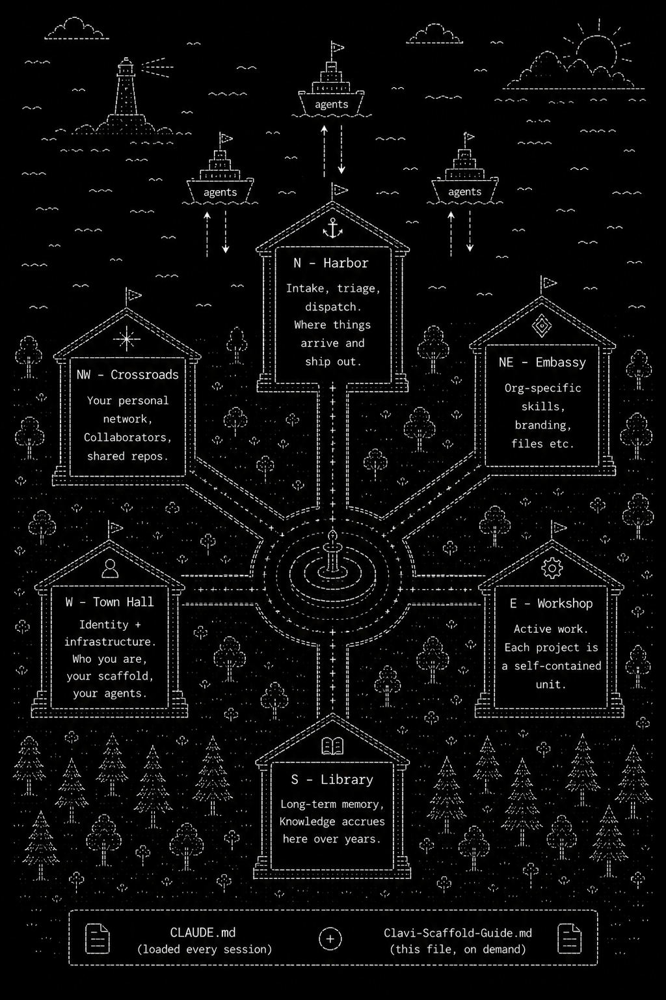

# Clavi-Scaffold

[](LICENSE)
[](#skills)
[](#quickstart)
[](https://claude.ai/claude-code)
[](Clavi-Scaffold-Guide.md)
[](https://x.com/AviParr)

> [!NOTE]
> **Beginner-friendly.** Claude can explain everything and help you set it up. This is primarily a system to help you and Claude build a shared context on your work over time.

```
                                                      ┌──┐
                                                      ┤  ├──────┬──   ┌─┐
                                              ┌─────┐ │  │      │     │ │              ┌──┐
                                              │     │ │  │      │     │ │       ┌──┐   │  │
  ██████╗██╗       █████╗ ██╗   ██╗██╗  ┌───┐ │     │ │  │      │     │ │┌──┐   │  │   │  │
 ██╔════╝██║      ██╔══██╗██║   ██║██║  │ ◈ │ ├─────┤ │  │      │ ┌──┐│ ││  │   │  │   │  │
 ██║     ██║      ███████║██║   ██║██║  ├───┤ │     │ │  │      □ │  ││ ││  │   │  │┌─┐│  │
 ██║     ██║      ██╔══██║╚██╗ ██╔╝██║  │   │ │     │ │  │        │  ││ ││  │┌─┐│  ││ ││  │
 ╚██████╗███████╗ ██║  ██║ ╚████╔╝ ██║  │   │ │     │ │  │        │  ││ ││  ││ ││  ││ ││  │
  ╚═════╝╚══════╝ ╚═╝  ╚═╝  ╚═══╝  ╚═╝  │   │ │     │ │  │        │  ││ ││  ││ ││  ││ ││  │
          s c a f f o l d               └───┴─┴─────┴─┴──┴────────┴──┴┴─┴┴──┴┴─┴┴──┴┴─┴┴──┘
```

This is the public version of [Avi Parrack](https://aviparrack.com/)'s scaffold. Fork it, run `/setup`, customize, make it yours.

---

## Quick visual: The Town

<p align="center">
  
</p>

---

## Six Spaces for Your Workflows

Spatially organized for ease of orientation so you get a sense of where things are in your second-brain, navigated by compass direction.

| Direction | Space | Function |
|---|---|---|
| **N** | **Harbor** | Intake, triage, dispatch, specs for your agents to go interface with the internet/world. |
| **W** | **Town Hall** | Identity + infrastructure. Who you are, your scaffold and meta level docs, universal constants, and ground truth. |
| **E** | **Workshop** | Active projects. Each project is a self-contained unit for workflows, context files, scripts, etc. Claude projects sit in queue waiting for you to greenlight with your spare tokens. |
| **S** | **Library** | Long-term memory. Your knowledge/context accrues here over years. |
| **NE** | **Embassy** | Org-specific files, skills, workflows, etc. |
| **NW** | **Crossroads** | your personal network. Collaborators, and shared repos. |

---

## Design principles

**1. Future-facing architecture.** Clavi is organizational structure, not prompts. It aims to grow gracefully under model swaps and platform migrations. Optimize for the next decade, not the next quarter.

**2. Should improve with smarter models.** No deep prompt engineering or model-specific hacks. Invest in *structure* (any model can navigate), *best practices* (collated as rules, not brittle prompts), *organic context growth* (years of accumulated knowledge), and *automated calibration loops* (system curates itself on minimal feedback).

**3. Lean on spatial organization.** The folder structure is a map, not a filing cabinet. Leverage human spatial memory: *"it's in the workshop, the Moon stuff we looked at last year"* is enough to find things. You develop **pointer recall** — agents should be able to find things in your shared brain without precise paths.

**4. Growing autonomy.** As the system better represents you, and agents become more capable they are calibrated to act more autonomously and accurately on your behalf. You become octopus-like: many semi-autonomous tentacles you direct varying amounts of attention toward.  

```
Manual   →   Supervised   →   Semi-autonomous   →  Autonomous
you do it    you review it    you spot-check it    you trust it
```

**5. Context as core value primitive.** The fundamental unit of value here is *accumulated, structured, living knowledge that compounds over time*. Research findings, calibrated preferences, patterns, commitments, taste. Every session should leave the system slightly richer. Nothing valuable should be lost to conversation ephemerality.

**6. Agents pushback.** Models are collaborators *building towards increasingly calibrated autonomy*. Pragmatically smart: a model that says *"I think you're wrong about X"* is more useful than one that silently executes.

**7. Make switching models not too painful, don't be brittle.** Markdown and plain files. No proprietary formats. The scaffold should survive Claude Code, be able to swap in future models, not waste too much time working on workarounds to agent limitations that will be patched in a month. Refactoring should be easy for models to handle and cheap. The priority is that context remains *usable* by future models.

---

## Quickstart

```bash
git clone https://github.com/AviParrack/Clavi.git
cd Clavi
claude   # opens an interactive Claude Code session
```

Then say: *"Run /setup."*

The Setup Wizard offers five paths: **⚡ Quick** (~5 min, just folders + automation lane + persistence), **🚶 Medium** (~25 min, baseline daily workflow), **🏗️ Full** (~60–90 min, everything wired up — splittable across sessions), **🎯 Pick** (name the phases you want), or **📚 Grow into it** (skip the wizard entirely and configure as you go). Anything you skip stays unfinished and resumable — type `/setup` anytime to come back.

After setup, queue your first build:

```bash
claude   # interactive
```

---

## The Three Instruments — Rules, Hooks, Skills

Claude Code provides three behavioral tools. We use a mix of each:

```
Rules  = "you should do X"     (Claude reads, follows pretty reliably)
Hooks  = "X is enforced"       (system fires mechanically, 100%)
Skills = "here's how to do X"  (instructions, invoked on demand)
```

| | **Rules** | **Hooks** | **Skills** |
|---|---|---|---|
| **What** | Behavioral constraints | Automated triggers | Capability instructions |
| **When loaded** | Auto, every session (path-scoped) | On lifecycle events | Description always; full body on invocation |
| **Enforcement** | High reliability (Claude follows) | Mechanical (system enforces) | On demand (invoked) |
| **Analogy** | Standing orders | Tripwires | Tool manuals |
| **Examples** | "Always cite sources" | "Block dangerous commands" | "Run a research sprint" |
| **Location** | `.claude/rules/` | `.claude/settings.json` hooks section | `.claude/skills/` |

---

## Context Loading — How Claude Reads This

CLAUDE.md is the most expensive file in the system — it loads every session. Three loading tiers:

### Tier 1: Always loaded (every session)
- **Root CLAUDE.md** — slim router (~100 lines, identity + compass + key refs)
- **`@path` imports** — referenced files expand inline at launch
- **Active rules** — only those matching the current directory (path/project-scoped)
- **Skill descriptions** — ~40 custom skills with descriptions ON; ~185 third-party with descriptions OFF (invoke via `/slash-command`)

### Tier 2: Loaded on navigation
- **Space-level CLAUDE.md** — `Harbor/CLAUDE.md`, `Workshop/CLAUDE.md`, etc.
- **Project HANDOFF.md** — when working inside a specific workshop project

### Tier 3: On demand
- **The full guide** — [Clavi-Scaffold-Guide.md](Clavi-Scaffold-Guide.md)
- **Reference docs** — archived research, detailed specs
- **Library content** — Knowledge Graph, logs, conversations

### Skill budget management
Custom skills (~40) have model invocation **ON** — Claude can match them automatically to user requests. Third-party skill packs (e.g., sci-, gstack-, acad-) have `disable-model-invocation: true` — they remain available via explicit `/slash-command` but don't consume the skill description budget.

### Path-scoped rules
Rules load only when working in matching directories — citation rules in Workshop/**, writing-voice in writing projects, dispatch rules in Harbor/Dispatch/**. This keeps each rule narrowly scoped to where it applies.

---

## The Three Context Documents

| | **CLAUDE.md** | **HANDOFF.md** | **Seance Log** |
|---|---|---|---|
| **Purpose** | "What is this place?" | "What's happening right now?" | "What did the last agent try?" |
| **Changes** | Rarely | Every session (via PreCompact) | Per autonomous agent session |
| **Content** | Folder contents, conventions, pointers | In-progress work, what's next, gotchas | Dead ends, reasoning, what failed |
| **Loaded** | Automatically (root + on navigation) | Via hook after compaction | Read by next Scout/Builder on boot |
| **Tone** | Reference manual | Running field notes | Post-mortem debrief |
| **Who writes** | User or Claude (rare) | Claude (prompted by hook) | Autonomous agents before shutdown |

---

## Module-by-Module I/O

### Harbor

**Inputs:** `/research-sprint` deposits to `Inbox/{topic}/`. Scouts (`/opportunity-scan`, `/network-scout`, `/watchlist-monitor`) deposit dated reports. `/voice-capture` transcribes Telegram voice messages. Workshop reverse-flow drops research questions.

**Triage outputs:**
| Tier | Destination |
|---|---|
| 🥇 Gold | wiki page + PREMISES.md + KEY_FINDINGS.md + cross-ref + Workshop link |
| 🟢 Green | wiki page + cross-ref + Workshop link |
| 🟡 Yellow | Library/Someday/ (topic tagged) |
| 🔴 Red | Delete (git preserves) |

**Dispatch outputs:** Twitter / X (via your custom tweet-pipeline skill if you build one), long-form forums (via `/draft-it` + an org-specific publish skill), email outreach (via `/email-triage` and `/network-scout` drafts), Telegram notifications. All logged to `Dispatch/log/`.

**Standing files:** `watchlist.md` (topics monitored), `wanted.md` (specific items), `todo.md` (running list), `opportunities.md` (curated pipeline).

### Workshop

Each project is a self-contained unit. Top-level = active. Sub-tiers: `Complete/`, `backburner/`, `archived/`.

**Inputs:** Promoted Green-tier items from triage, Library reference material (read-only), direct work files.

**Outputs:** Finished content → Dispatch. Key findings → Knowledge Graph. Shipped projects → `Workshop/Complete/`.

**Guardrails:** All outputs stay inside the project folder. Use subfolders. Update in place — no v1/v2/v3 accumulation. Git is the safety net.

### Library

**Inputs:** Wiki pages from `/triage`. Session metadata from hooks. Conversation transcripts from `/save-conversation`. Pattern synthesis from `/memory-synthesis` (weekly).

**Outputs:** PREMISES.md and KEY_FINDINGS.md grounding all research. Knowledge-Graph/wiki/ as the compiled-knowledge base. Logs feeding the taste convergence loop.

**Structure:**
```
Library/
  Knowledge-Graph/
    PREMISES.md         ← constitution
    KEY_FINDINGS.md     ← canonical running list of key results you want at your finger-tips
    index.md            ← catalog of all wiki pages
    wiki/               ← Karpathy-style synthesis pages
  Logs/                 ← session, metadata, feedback, PATTERNS
  Conversations/        ← exported transcripts
  Someday/              ← 🟡 Yellow triage items
  Archive/              ← completed/superseded material
```

### Town Hall

**Loaded every session:** root CLAUDE.md + path-scoped rules + skill descriptions. Subdirectory CLAUDE.md files load on navigation.

**Structure:**
```
Town-Hall/
  User/
    User.md             ← identity, interests, calibration
    Web-Presence/       ← canonical links file
    Personal-Dev/       ← growth tracking, debugging-mode logs
    Aesthetics/         ← design references, taste signals
  Scaffold/
    autodesk/           ← multi-agent orchestration + seance logs
    [submodules]        ← gstack, sci-skills, academic, etc.
```

### Embassy + Crossroads

**Embassy** — Add one folder per organization you belong to and dump relevant files (standards, style guides, internal process, etc.) accsesible by Claude to save you time.

**Crossroads** — `Network.md` (people), `repos.yaml` (whitelisted external repos). The trust boundary for adding external skill collections.

---

## The Knowledge Pipeline — The 6Rs

```
Input → RECORD → REDUCE → REFLECT → GATE (human) → INTEGRATE
```

All research enters through `Harbor/Inbox/`. Nothing integrates without sign-off.

| Tier | Treatment |
|---|---|
| **🥇 Gold** | Update PREMISES.md (constitution) + KEY_FINDINGS.md + create wiki page + reweave connected files |
| **🟢 Green** | Create wiki page + cross-references + optionally KEY_FINDINGS |
| **🟡 Yellow** | Library/Someday/ with topic tags |
| **🔴 Red** | Delete (with rejection note in commit) |

**Reverse flow:** Workshop gaps feed back to Harbor/Inbox/ as research requests. Active projects identify what needs investigating; the inbox absorbs those questions.

### Karpathy Wiki Pattern

When a research query or conversation produces a strong synthesis, save it as a new page at `Library/Knowledge-Graph/wiki/{topic-slug}.md`. Explorations compound rather than disappearing into conversation history. Each wiki page has YAML frontmatter linking it to source files, Workshop projects, related pages, and tags. The `index.md` catalogs all pages; the `log.md` tracks every ingest.

**Bidirectional linking** (Gold + Green): wiki frontmatter includes `projects: [Workshop/X/]`; Workshop project HANDOFF.md cites `Wiki: [[topic-slug]]`. Weekly `/memory-synthesis` lints for broken links.

---

## The Living Handoff — PreCompact in Detail

The most important architectural innovation in Clavi.

**The staleness problem:** HANDOFF.md files go stale because Claude doesn't routinely update them. Sessions get abandoned. Context gets lost.

**The solution — the PreCompact hook:**

```
Working in a workshop → context fills up → PreCompact fires
  → Hook prompts Claude: "Update this project's HANDOFF.md"
  → Claude writes current state while context is still warm
  → Compaction proceeds
  → SessionStart (compact) re-injects the fresh HANDOFF.md
```

Even if a session is never returned to, the HANDOFF is current. A new Claude instance opening that workshop reads the subdirectory CLAUDE.md, follows it to the HANDOFF.md, and picks up seamlessly.

This is what makes the long-running, multi-instance, time-capsule property of Clavi actually work.

---

## Hooks — The System's Nervous System

| Hook | Trigger | Reads from | Writes to |
|---|---|---|---|
| **PreCompact** | Before compaction | Current project context | `Workshop/[project]/HANDOFF.md` |
| **SessionStart** | Startup + after compact | `HANDOFF.md` | Context injection (orientation) |
| **PostToolUse** (async) | Every tool call | Tool input metadata | `Library/Logs/metadata/*.jsonl` |
| **UserPromptSubmit** (async) | User says "feedback" | User message | `Library/Logs/feedback-log.md` |
| **SubagentStart** (async) | Agent spawn | Session metadata | `Library/Logs/metadata/*.jsonl` |
| **PreToolUse: Bash** | Bash commands | Command text | Blocks dangerous commands |
| **PreToolUse: reply** | Telegram sends | File attachments | Blocks credential sends |
| **Notification + Stop** | Events | — | macOS notifications |

The async hooks impose zero latency cost on the main work — they fire in the background, write to disk, and return.

---

## The Taste Convergence Loop

Clavi's automated calibration cycle. The system improves on minimal feedback.

```
Weekly:
  1. Scan       — patterns of interest across projects, conversations,
                  session logs, feedback log
  2. Hypothesize — generate hypotheses about miscalibration
  3. Score      — present hypotheses for minimal user ranking
  4. Calibrate  — adjust weights, priorities, behavioral patterns
  5. Record     — log calibration changes in PATTERNS.md
```

Combined with the **feedback capture hook** (UserPromptSubmit detecting "feedback" → logs to `feedback-log.md`), the system accumulates corrections without requiring active memory-saving from the user. Over time, sparse feedback signal converges on user judgment.

---

## Skills by Flow

Custom skills shipped (~40), grouped by where they fit in the system.

### Inbound — Harbor/Inbox
`/research-sprint`, `/opportunity-scan`, `/network-scout`, `/watchlist-monitor`, `/triage`, `/voice-capture`

### Outbound — Harbor/Dispatch
`/draft-it`, `/email-triage`, `/meeting` (plus org-specific publish skills as needed)

### Workshop — active project work
`/deep-review`, `/fact-check`, `/BOTEC-brief`

### Library — memory + analysis
`/memory-synthesis`, `/debugging-mode`

### Daily Operations
`/morning-briefing`, `/triage`, `/email-triage`

### Multiplex Agents to Get Better Answers (~11 skills bundled; more available via skill packs)
`/ask-many-times`, `/ask-many-ways`, `/ask-many-contexts`, `/ask-mega`, `/explore-tree`, `/decompose`, `/adversarial-prompt`, `/premise-audit`, `/steelman-duel`, `/consensus-check`, `/blind-review`, `/epistemax` (chains 5 of these into a master audit). `/ask-many-models` and `/save-conversation` ship as part of optional skill packs (install via `/crossroads-add`).

### Meta — Town Hall
`/setup`, `/health-check`, `/skill-list`

### Crossroads
`/crossroads-add`, `/crossroads-scan`, `/crossroads-install`

### Creative
`/songwriting`, `/sample-extraction`

---

## Automation Schedule

When the cron entries from `Harbor/Dispatch/agents/crontab.txt` are installed, the scaffold runs autonomously:

| Time | Agent | What |
|---|---|---|
| 4:00 AM | `/watchlist-monitor` | Overnight news scan |
| 4:20 AM | `/opportunity-scan` | New conferences, grants, fellowships |
| 4:40 AM | `/network-scout` | High-value people to connect with |
| 4:50 AM | `/crossroads-scan` | Updates from whitelisted external repos |
| 6:30 AM | `/email-triage` | Pull last 24h, build queue, urgent → Telegram |
| 7:00 AM | `/morning-briefing` | Synthesize all above + calendar + todos → Slack/Telegram |
| Sunday 10 AM | `/memory-synthesis` | Weekly memory consolidation, lint wiki, promote feedback |
| Every 30 min | `builder-manager.sh` | Spawn autonomous builders for green-lit projects (gated on usage <85%) |

---

## Search — QMD

**QMD** is on-device semantic search via MCP. Indexes the entire workspace, returns relevant files by meaning (not just keyword match). BM25 + vector + reranker. Runs locally; zero ongoing cost.

Refresh: `qmd update && qmd embed`.

Use in any session: query the `mcp__qmd__search` tool, or just ask Claude *"find files about X"* — it'll route through QMD when QMD is configured.

---

## Sharing & Distribution

### Three modes for adopting Clavi

**(a) Clone-and-init** — full system adoption
```
git clone → /setup → ready to use
```

**(b) Rip individual modules** — each module self-contained with README + install. The knowledge pipeline, the triage system, the writing voice, the hooks — each works independently.

**(c) Org attachment** — your team's standards as an Embassy, layered over personal Clavi.

### Four distribution layers

| Layer | Scope | Contents |
|---|---|---|
| **Core** | Anyone | Config system, memory, hooks, rules engine, onboarding docs |
| **Community** | Open source | Skill packs, MCP integrations, plugins |
| **Org** | Team | Shared standards, style guides, publication pipeline |
| **Personal** | Individual | Identity, preferences, projects, research, taste |

These map to Claude Code's native settings hierarchy.

---

## Quick Reference

| I want to... | Go to... |
|---|---|
| Start a new project | Create a folder in `Workshop/` |
| Get my daily briefing | `/morning-briefing` or check Slack/Telegram |
| Triage incoming research | `/triage` (processes `Harbor/Inbox/`) |
| Process my email | `/email-triage` (gates Gmail) |
| Check what's active | `Workshop/CLAUDE.md` or root CLAUDE.md |
| Find old research | `Library/Knowledge-Graph/` or QMD search |
| Ship content to the world | `Harbor/Dispatch/` |
| See who to connect with | `/network-scout` or `Crossroads/Network.md` |
| Give Claude feedback | Say "feedback" in conversation (auto-logged) |
| Send a voice note to Claude | Telegram voice message |
| Test a claim's robustness | `/ask-mega` or `/epistemax` |
| Red team an argument | `/adversarial-prompt` |
| Find hidden assumptions | `/premise-audit` |
| Schedule a meeting | `/meeting` |
| Check scaffold integrity | `/health-check` |
| Understand the system | [Clavi-Scaffold-Guide.md](Clavi-Scaffold-Guide.md) |

---

## Architectural Influences

Clavi also borrows ideas from:

- **Boris Cherny** (Claude Code creator) — ~100-line CLAUDE.md, minimal customization
- **Andrej Karpathy** — wiki feedback loop where query results compound as library pages
- **DoorDash Team OS** (Stulberg) — three-tier context loading, nested navigation indexes
- **Gas Town** (Yegge) — seance logs for agent session handoffs
- **QMD** (Lutke) — on-device semantic search via MCP
- **"Codified Context"** — hot-memory / cold-memory split

Native Claude Code features adopted:
- `@path` imports for modular CLAUDE.md
- Subdirectory CLAUDE.md stacking
- Path-scoped rules
- `disable-model-invocation: true` for skill budget management
- Hooks system (28 lifecycle events)
- Settings hierarchy (Managed > Local > Project > User)

---

## Status

This is a working scaffold being actively used. It is opinionated, partial, and continually evolving. PRs and issues welcome on patterns that would broaden the appeal beyond a single user; please don't expect a "general productivity tool" — the design assumes a knowledge worker doing long-horizon research.

License: see [LICENSE](LICENSE).
